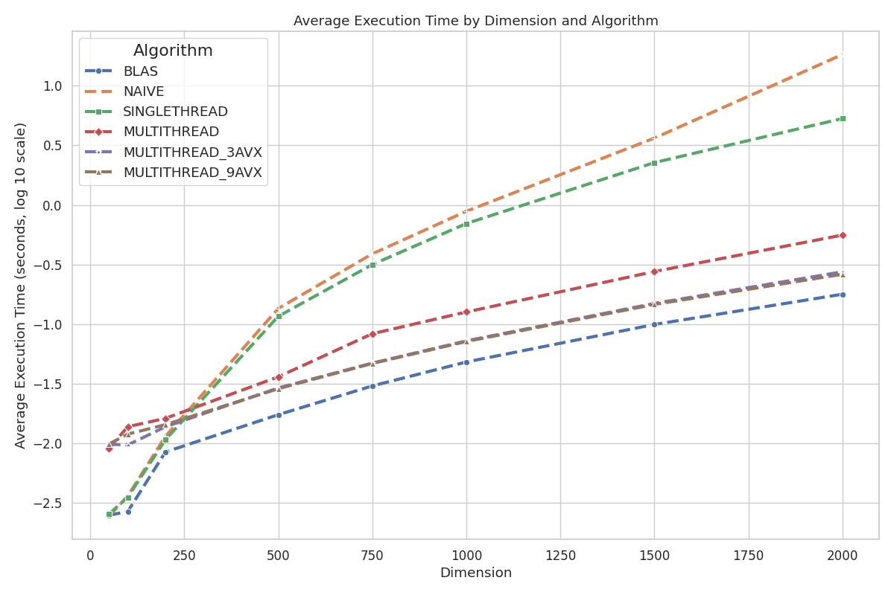

# MatrixMul-CPU

## Preview


## How to Run

### Source Code

To access the source code, clone the repository from GitHub:

```bash
git clone https://github.com/Papaglory/MatrixMul-CPU
cd MatrixMul-CPU
```
### Running a Test File Using 'manfile'

1. With the C compiler 'gcc' and 'make' installed, run the following command.

    ```bash
    ./manfile
    ```

2. Run the executable file:

    ```bash
    ./program
    ```

To compile with a different test file, edit line 8 in the 'manfile' to specify the desired test file. Note that the 'manfile' is built upon the 'makefile' due to issues compiling the 'makefile' directly with test files.

## Further Information

For an in-depth look at this project, please refer to [mariusnaasen.com/projects/matrixmul-cpu](https://mariusnaasen.com/projects/matrixmul-cpu).

## Author
Marius H. Naasen, originally created December 2024.
